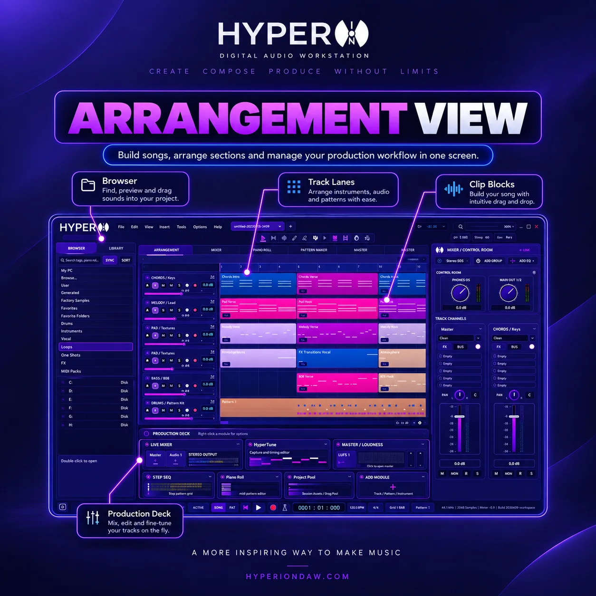
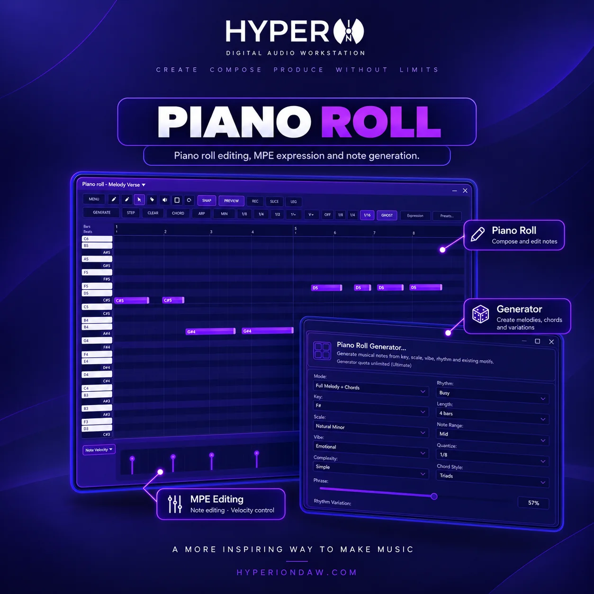
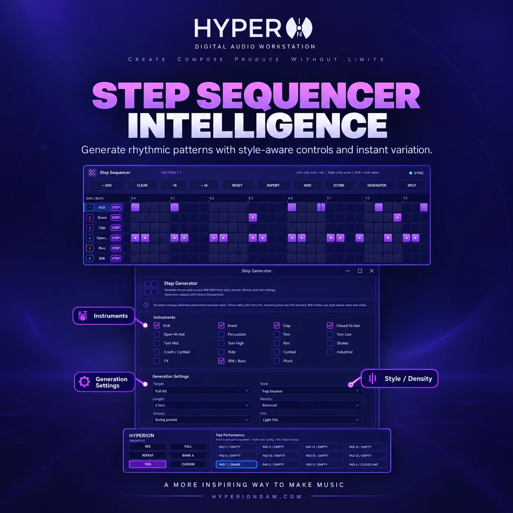
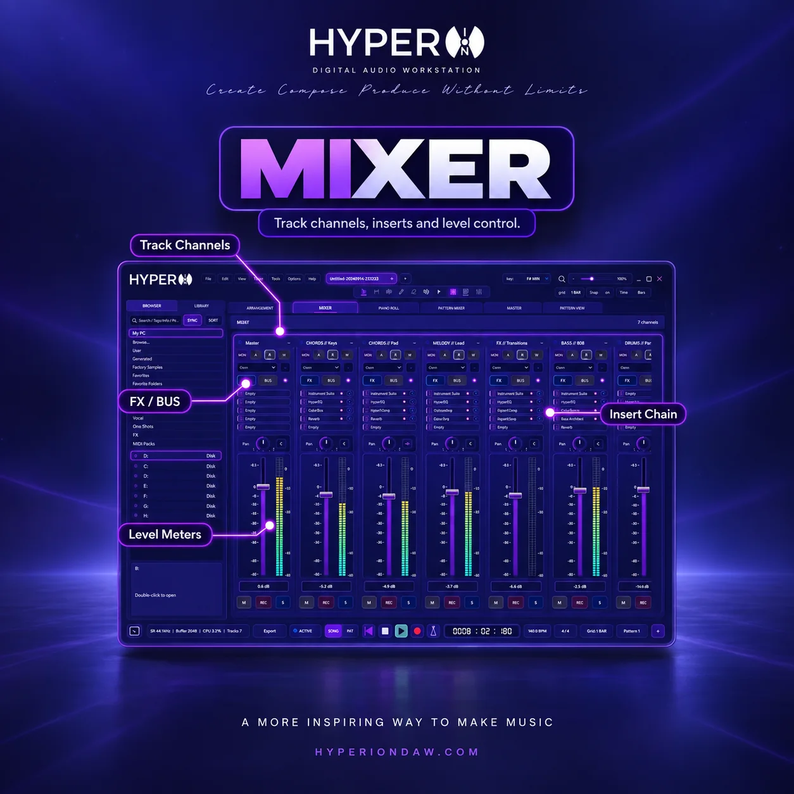
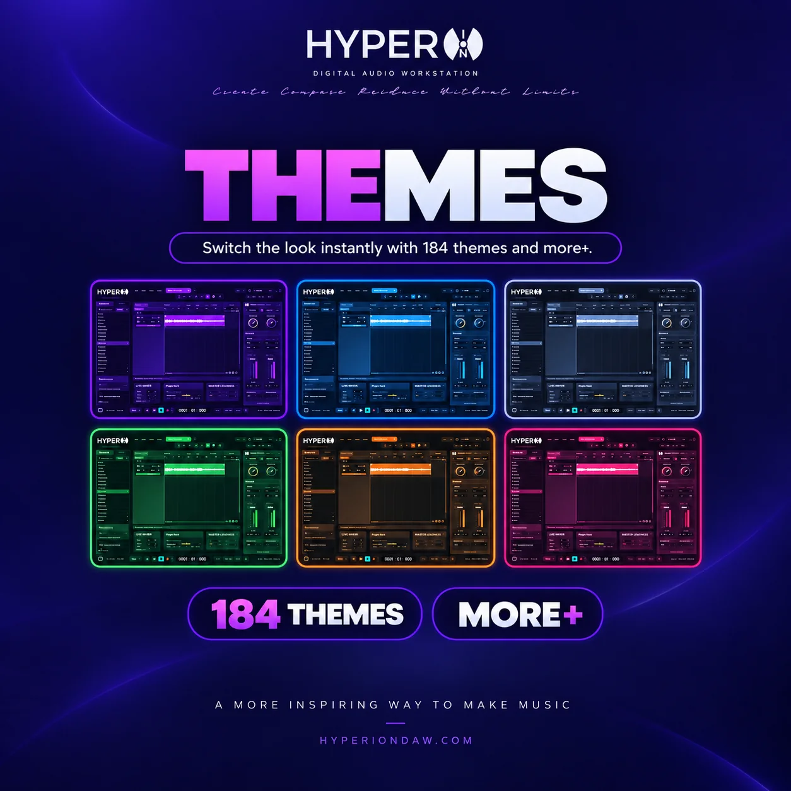
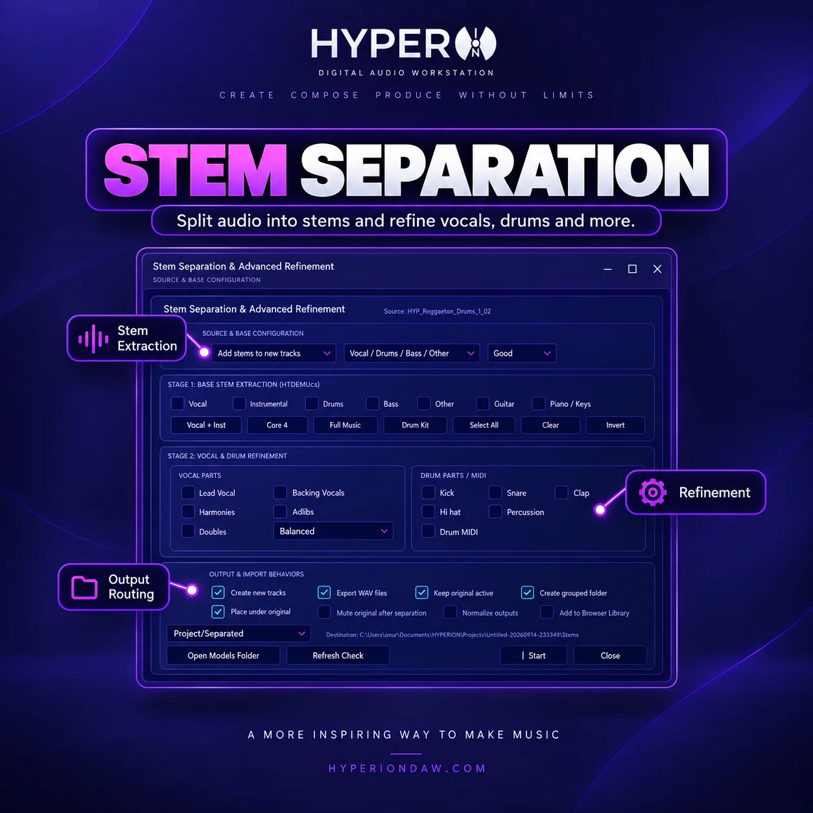
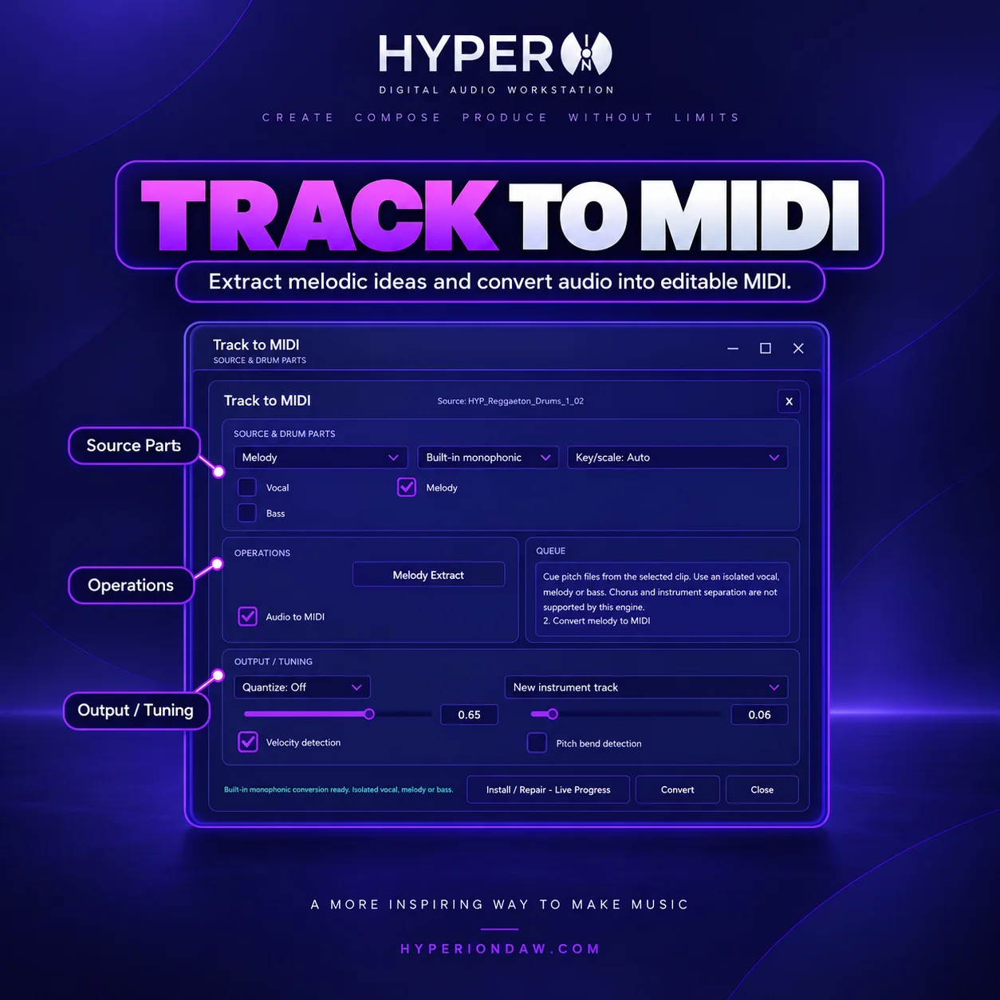
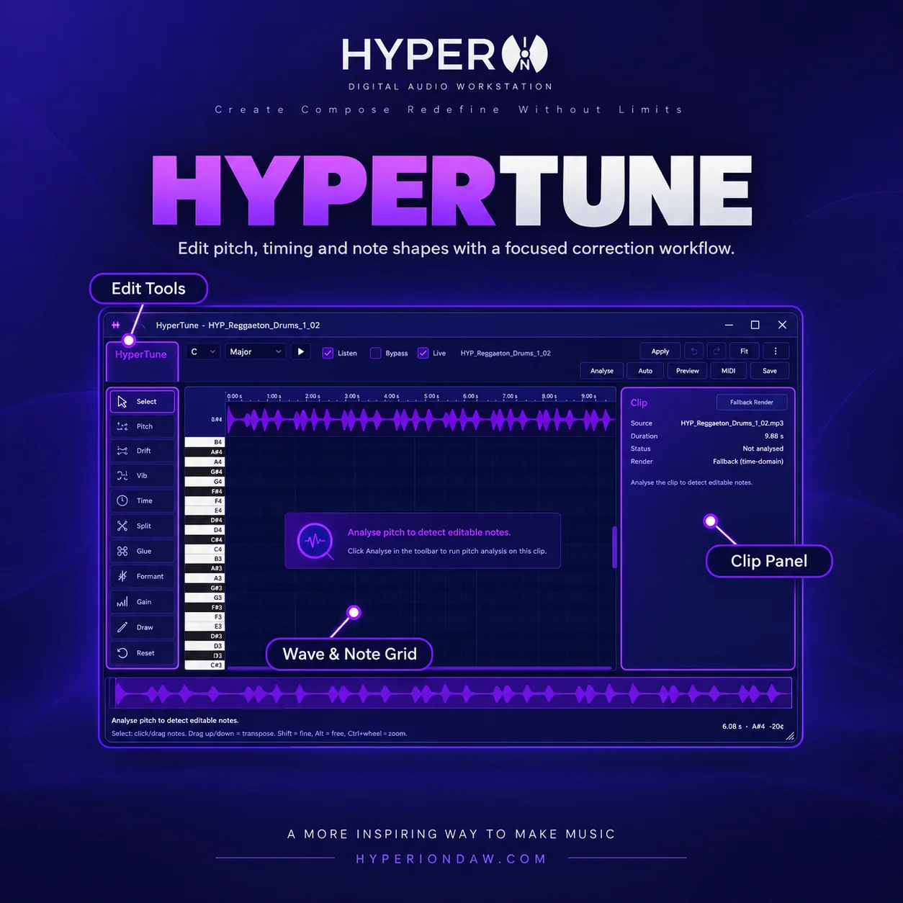
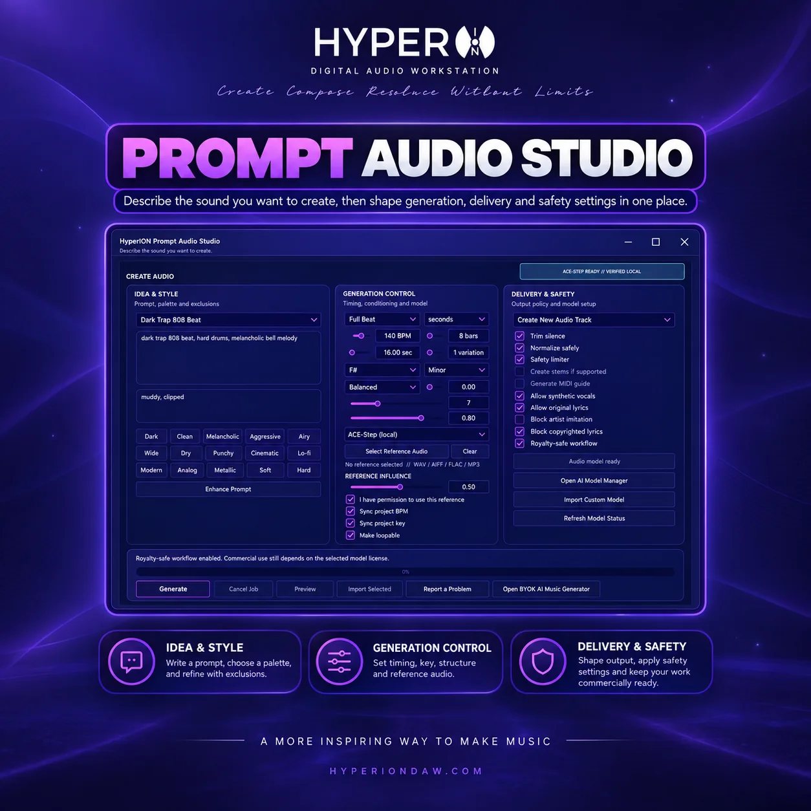

  

  # HyperION DAW

  **Create, arrange, record, mix and finish music in one workspace.**

  [Explore the website](https://www.hyperiondaw.com/) · [Download HyperION](https://www.hyperiondaw.com/download) · [Compare editions](https://www.hyperiondaw.com/editions) · [Browse screenshots](https://www.hyperiondaw.com/screenshots) · [Play generator demos](https://www.hyperiondaw.com/generator-demos)

HyperION combines audio and MIDI recording, an editable arrangement, Piano Roll, Step Sequencer, routing and mixing tools, and creative generators. The public download page lists Windows x64, macOS Universal, and Linux x64/ARM64 packages for version 1.1.5.0. Check that page for the latest available build and installation details.

## See the current workflow

<table>
  <tr>
    <td width="50%"> <strong>Piano Roll</strong> Compose and edit MIDI parts.</td>
    <td width="50%"> <strong>Step Sequencer</strong> Build rhythms and generate variations.</td>
  </tr>
  <tr>
    <td> <strong>Mixer</strong> Balance channels, inserts and routing.</td>
    <td> <strong>Themes</strong> Choose an interface that fits your workspace.</td>
  </tr>
  <tr>
    <td> <strong>Stem Separation</strong> Separate a source into musical parts.</td>
    <td> <strong>Track to MIDI</strong> Turn audio ideas into editable MIDI.</td>
  </tr>
  <tr>
    <td> <strong>HyperTune</strong> Edit pitch and timing.</td>
    <td> <strong>Prompt Audio Studio</strong> Explore assisted sound creation.</td>
  </tr>
</table>

The [full screenshot gallery](https://www.hyperiondaw.com/screenshots) has more views of the current workspace and tools. Listen to [Song Starter and Native VST examples](https://www.hyperiondaw.com/generator-demos) in the browser.

## Editions and downloads

| Edition | Best for | Current public pricing |
| --- | --- | --- |
| [Free / Demo](https://www.hyperiondaw.com/editions/demo) | Trying the workflow with limited saving, exports and AI allowance | Free |
| [Standard](https://www.hyperiondaw.com/editions/standard) | Full core production workflow | $20 one-time |
| [Ultimate](https://www.hyperiondaw.com/editions/ultimate) | Expanded AI and creative tools | $30 one-time |

Edition limits and available features can change with releases. Use the [live comparison](https://www.hyperiondaw.com/editions) before purchasing. Download the correct package for your system from the [official download page](https://www.hyperiondaw.com/download).

## Help and feedback

- [Manual](https://www.hyperiondaw.com/manualen) and [FAQ](https://www.hyperiondaw.com/faq)
- [Contact the team](https://www.hyperiondaw.com/contact) for support, licensing or partnerships
- [Request a feature](https://www.hyperiondaw.com/) from the main site; approved and added requests appear on the [coming features page](https://www.hyperiondaw.com/coming-features)
- [Open a bug report](https://github.com/HyperionDAW/HyperION/issues/new?template=bug_report.yml) or [propose a feature](https://github.com/HyperionDAW/HyperION/issues/new?template=feature_request.yml) on GitHub

This repository hosts public product information, releases and issue discussions. HyperION application source code is not currently published here.
